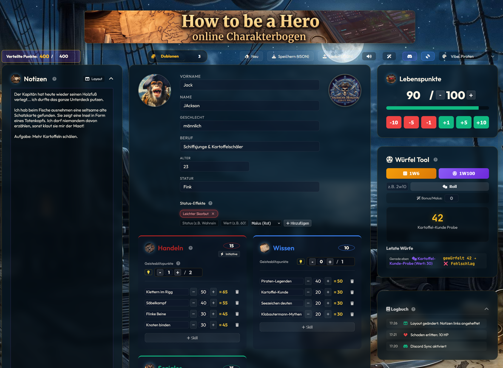

<div align="center">
  
  <h1>🎲 How to be a Hero - Digital Character Sheet & GM Dashboard 🎲</h1>

  <p>
    <strong>Ein interaktiver, regelkonformer und voll animierter Charakterbogen + Live Spielleiter-Dashboard für das "How to be a Hero" Pen & Paper System.</strong><br>
    <em>Ein Community-Projekt für die fantastische Rocket Beans und HTBAH Community! 💖</em>
  </p>

  [](https://opensource.org/licenses/MIT)
  [](https://howtobeahero.de)
</div>

<hr />

<p align="center">
  
  
</p>

## 🌟 Projektübersicht
Moin Moin an alle Bohnen und Pen & Paper Fans! 👋

Dieses Projekt ist aus reiner Leidenschaft für das *How to be a Hero* Regelwerk entstanden. Das Ziel war es, eine moderne, digitale Alternative zu statischen PDFs oder Excel-Tabellen zu schaffen, die nicht nur rechnet, sondern auch beim Spielen richtig Spaß macht. 
**Das absolute Highlight:** Ein integriertes, serverloses **Multiplayer-System**. Spieler und Spielleiter (SL/GM) können sich in Sekundenschnelle live verbinden – komplett kostenlos, ohne Accounts und ohne Server-Setup!

## 🚀 Live Demo & Nutzung
🔗 **[Hier geht's direkt zur App (Live-Demo)](https://dondavis-vibe.github.io/how-to-be-a-hero-character-sheet/)**

**Kurzanleitung:**
1. Öffne den Link in deinem Browser.
2. Trage deine Werte ein, das Tool übernimmt alle Hintergrundberechnungen.
3. Speichere deinen Charakter als `.json`-Datei lokal ab, um ihn fürs nächste Mal aufzuheben.
4. **Für Multiplayer:** Klicke oben auf das 📡-Icon, gib den Raum-Code deines Spielleiters ein und du bist live verbunden!

---

## 🧙‍♂️ NEU: Live-Sync & GM Dashboard (Multiplayer)
Dank WebRTC (PeerJS) bietet das Tool einen echten Live-Modus. **Keine Registrierung, keine Serverkosten.**

### 👑 Für den Spielleiter (GM):
* **1-Klick Hosting:** Klicke im 📡-Menü auf "Als Spielleiter (GM) hosten". Du erhältst einen kurzen Raum-Code (z.B. `1A2B`), den du deinen Spielern gibst.
* **Live-Dashboard:** Sobald Spieler beitreten, tauchen sie in deinem Dashboard auf. Das Dashboard bietet:
  * **Echtzeit-Spielerkarten:** HP, Profilbild, Skills, Inventar, Waffen, Status und Währung aller Spieler auf einen Blick.
  * **Anti-Cheat System:** Rote Warnung, falls ein Spieler mehr als die erlaubten 400 Punkte verteilt hat.
  * **Notizen & Archiv:** Geheime SL-Notizen pro Charakter + allgemeine Kampagnen-Notizen. Das Notizen-Archiv zeigt auch Notizen abwesender Spieler.
  * **Save & Load:** Exportiere und importiere all deine SL-Notizen als JSON-Datei.
  * **Farbcodierung:** Weise jedem Spieler eine eigene Farbe zu für perfekten Überblick.
  * **Live-Logbuch:** Jeder Wurf und jede Aktion der Spieler poppt sofort im GM-Logbuch auf!
  * **GM Würfel-Box:** Eigene Würfel für den SL (1W100, 1W6, Custom), deren Ergebnisse (inkl. Konfetti bei Krits!) lokal angezeigt werden.

### 🦸‍♂️ Für die Spieler:
Einfach den 4-stelligen Code des Spielleiters eingeben und auf "Beitreten" klicken. Ab jetzt werden alle eure Würfe, Lebenspunkte-Updates und Inventar-Änderungen live auf den Monitor des Spielleiters synchronisiert.

### 🤖 Optional: Discord Webhook Sync (Für alle sichtbar)
Wenn ihr wollt, dass **auch alle Spieler** untereinander die Würfe sehen (z.B. wenn ihr in einem Voice-Call seid), könnt ihr zusätzlich zum Live-Dashboard die native Discord-Integration nutzen:
1. Der Spielleiter erstellt im Textkanal eures Discord-Servers einen **Webhook**.
2. Er kopiert die Webhook-URL und teilt sie mit den Spielern.
3. Die Spieler fügen die URL oben im Tool bei Discord Sync ein.
4. **Ergebnis:** Jeder Wurf poppt sofort live im Discord-Chat auf – mit dem Charakter-Namen als Absender und schicken Emojis!

---

## ⚙️ Core Features (Regelkonform)
Wir haben großen Wert darauf gelegt, die Mechaniken so exakt wie möglich nach dem offiziellen Regelwerk abzubilden:
- **Vollautomatisierung:** Basiswerte (Handeln, Wissen, Soziales), Geistesblitzpunkte (GBP) und Skill-Boni werden automatisch berechnet.
- **1-Klick Proben & Initiative:** Klicke direkt auf deine Skills, Basiswerte oder den **Initiative-Button** (`1W10 + Handeln`), um blitzschnell zu würfeln.
- **Dynamische Krits:** Kritische Erfolge (die ersten 10% des Skillwerts) und Patzer (die oberen 10%) werden dynamisch anhand deines genauen Werts berechnet (inkl. Konfetti & Sounds!).
- **HP & Status:** Flexibel anpassbare Status-Effekte (Bonus/Malus) und eine dramatische **visuelle HP-Warnung** (rotes Pulsieren), sobald dein Charakter auf ≤ 10 Lebenspunkte fällt.
- **Smartes Würfel-Tool:** Jeder Wurf wird dokumentiert. Trage im Würfel-Tool schnell einen **Spielleiter-Bonus/Malus** ein, der völlig automatisch in deinen nächsten Wurf eingerechnet wird! 
- **Aktions-Logbuch:** Ein eigenes, aufklappbares Logbuch dokumentiert automatisch chronologisch alle Änderungen an HP, Währung, Inventar, Waffen und Status-Effekten.

---

## 🎨 13 Epische Themes
Wechsle das Design deines Charakterbogens passend zur Kampagne. Alle Themes verändern das Layout, die Farben, die Icons und bringen coole, performance-freundliche CSS/JS-Animationen mit (welche man für schwächere Geräte auch per Klick auf den 🚀 ausschalten kann):

* ⏳ **Zeitreise (Standard)** - Wabernde Risse im Raum-Zeit-Kontinuum.
* ⚙️ **Steampunk** - Langsam drehende, schwebende Zahnräder.
* ☢️ **Apokalypse** - Leuchtend grüne Strahlungsasche weht über den Screen.
* 💻 **Cyberpunk** - Vertikaler digitaler Neon-Matrix-Regen.
* 🥃 **1920s Mafia** - Prasselnder Regen und mysteriöser Zigarrenrauch.
* 🐙 **Lovecraft (Cthulhu)** - Eldritch-Nebel, wachende Augen und "Sanity Twitches".
* 🪄 **Royal Magic** - Schwebende, leuchtende Magie-Partikel.
* 🌌 **Deep Space** - Funkelnde Sterne und schnelle Sternschnuppen.
* 🏜️ **Wilder Westen** - Trockene Wüste mit rollendem Tumbleweed.
* 🏴‍☠️ **Piraten** - Sanft rollende Ozeanwellen und riesige Kraken-Tentakel.
* 💥 **Superhelden** - Knallige Comic-Farben und dynamische Halftone-Schatten.
* ⚔️ **Mittelalter** - Aufsteigende Funken und glühende Asche am Lagerfeuer.
* 💎 **Ultracore** - Schwebende Magitek-Energiekristalle aus dem Kern.

*(Bonus: Wenn der SL ein Theme wechselt, wird dies optional bei allen verbundenen Spielern synchronisiert, um die Stimmung am virtuellen Tisch zu lenken!)*

---

## 🤝 Kompatible Tools & Integrationen
Dieses Tool ist voll kompatibel mit dem **[PnPMaster](https://github.com/Rec0iL/PnPMaster)** – einem umfangreichen GM Tool von **[@Rec0iL](https://github.com/Rec0iL)**. 
Du kannst Charaktere (via `.json` Export) direkt in PnPMaster einlesen und verwalten!

---

## 💻 Für Entwickler & Contribution
Da dieses Tool komplett clientseitig (pure HTML, CSS und Vanilla JS) gebaut ist, kannst du es extrem einfach lokal anpassen. Kein npm, kein webpack, keine Node-Abhängigkeiten!
```bash
# Repo klonen
git clone https://github.com/DonDavis-vibe/how-to-be-a-hero-character-sheet.git

# Einfach in den Ordner wechseln und die index.html im Browser öffnen!
```
Für Infos zur internen Datenstruktur: [DATA_FORMAT.md](DATA_FORMAT.md).

## 📜 Lizenzen
- **Code:** Der Quellcode dieses Tools steht unter der [MIT License](LICENSE).
- **Regelwerk:** Das P&P Regelsystem "How to be a Hero" der *Rocket Beans* Community steht unter der **CC BY-NC-SA 4.0** Lizenz. (Siehe [howtobeahero.de](https://howtobeahero.de/))
