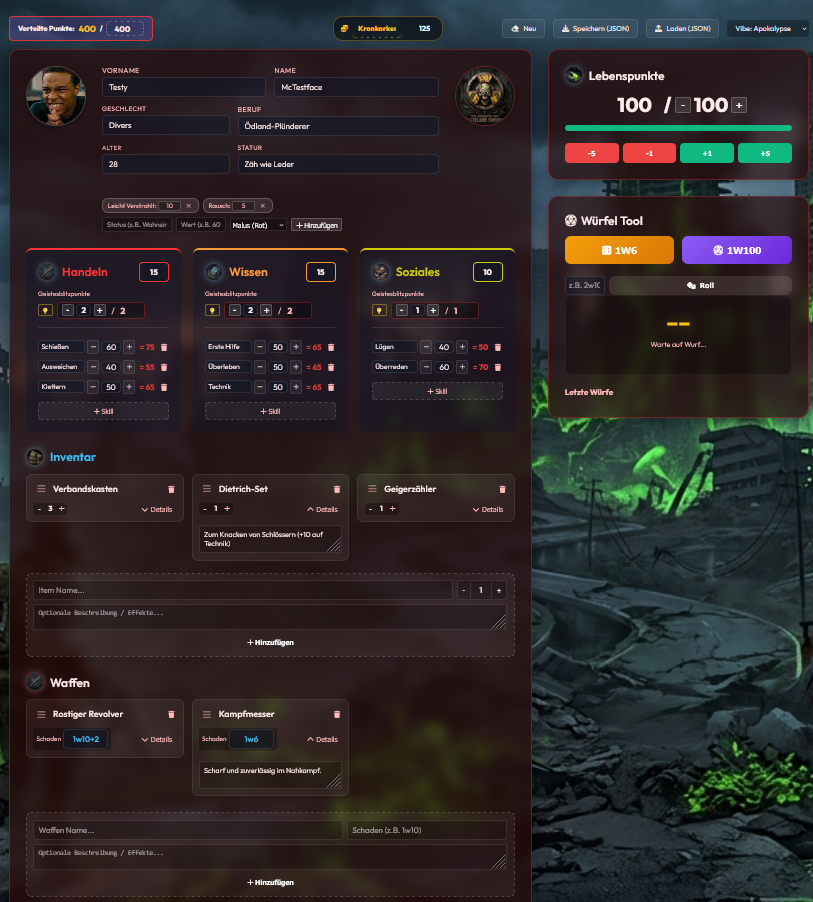

  
  <h1>🎲 How to be a Hero - Digital Character Sheet 🎲</h1>

  

    <strong>A highly customizable, responsive, and beautiful digital character sheet for the "How to be a Hero" Pen & Paper roleplaying system.</strong>
  

  
  
  

## 🚀 Live Demo
Spiele sofort los und erstelle deinen Charakter direkt im Browser:
👉 **[Hier geht's zur Live-Demo](https://dondavis-vibe.github.io/how-to-be-a-hero-character-sheet/)**

## ✨ Features

- ⚙️ **Offizielle Regelwerks-Kalkulation:** 
  - Basiswerte (Handeln, Wissen, Soziales) werden **automatisch berechnet** (Summe / 10, kaufmännisch gerundet).
  - Maximale **Geistesblitzpunkte (GBP)** werden absolut regelkonform abgeleitet.
- 🎲 **Smartes Würfel- & Log-System:**
  - **1-Klick Proben:** Klicke einfach auf das '=' neben einem Skill, um sofort auf den Wert zu würfeln. Das Ergebnis (Erfolg, Fehlschlag, Krit) wird live ausgewertet und im Log vermerkt!
  - **Waffen-Schaden:** Klicke im Inventar auf das Waffen-Icon, um direkt den Waffenschaden (z.B. W6+2) auszuwürfeln.
  - **Custom Dice Generator:** Standard W6 & W100 Würfel sowie flexible Eingabe (z.B. `2w10`, `3d8`) mit dynamischem Würfel-Log und visuellen Konfetti/Totenkopf-Effekten bei kritischen Erfolgen und Patzern!
- 🧬 **Dynamische Status-Effekte:**
  - Lege beliebig viele eigene Status-Effekte an (z.B. "Wahnsinn", "Verstrahlt").
  - Weise ihnen bei Bedarf einen Wert (z.B. "60%") zu. Alle Werte lassen sich per Klick live editieren.
  - Klassifiziere sie als **Malus (Rot)**, **Bonus (Grün)** oder **Neutral (Grau)** für maximale Übersicht.
- 💡 **Interaktives GBP-Tracking:**
  - Behalte den Überblick über deine Geistesblitzpunkte mit einem interaktiven Widget in der Werkzeugleiste.
  - Verbrauche GBP per Klick, was sofort dokumentiert wird.
- 🎒 **Dynamisches Inventar & Waffen-Management:**
  - Modernes, kachelbasiertes Grid-Design für Gegenstände und Waffen.
  - **Drag & Drop** Funktionalität zum Sortieren deines Equipments.
  - Jedes Item und jede Waffe hat **einklappbare Details/Beschreibungen**, die den Platz optimal ausnutzen.
- 🛠️ **Erweitertes Charakter-Management:**
  - Überall im Tool kommen schicke, eigene **[+] / [-] Buttons** zum Einsatz (für Skills, Items, HP, GBP) statt der hässlichen Standard-Pfeile des Browsers.
  - Einklappbares **Notizen**-System mit coolen 3D-Icons (perfekt für Lore, Quests oder Geheimnisse).
  - Profilbild-Upload (oder GIF-Upload) für deinen Helden!
- 🎨 **Epische Themes & Animierte UI-Effekte:** 
  - Wähle aus maßgeschneiderten Themes wie *Zeitreise*, *Steampunk*, *Cyberpunk* und *Apokalypse*! Jedes Theme ändert das komplette Layout (Hintergründe, Logos, Farben und alle UI-Icons).
  - **Dynamische Hintergrund-Animationen:** Fliegende Asche in der Apokalypse, tickende Zahnräder beim Steampunk, Neon-Regen im Cyberpunk oder wabernde Zeitrisse. 
  - **FX Toggle:** Alle Animationen lassen sich mit einem Klick auf den Zauberstab (🪄) oben rechts an- und ausschalten!
  - Inklusive dynamischem Mouse-Spotlight-Effekt (das Licht folgt deiner Maus über das moderne Glassmorphism-UI).
- 💾 **100% Offline & Lokal Speichern:** 
  - Keine Datenbank! Lade deinen Charakter als `.json` Datei herunter und teile ihn mit deinem Spielleiter.
  - **Tipp:** Lade dir den Beispiel-Charakter `dr_aris_thorne.json` (im `assets/` Ordner) oder den neuen `test_character.json` mit coolem GIF-Portrait in die App, um alle Features (Waffen, Themes, Status) sofort live in Aktion zu sehen!

## 🚀 Nutzung

1. Öffne das Tool über den Link zur **Live Demo**.
2. **Daten eintragen:** Fülle deinen Namen, Beruf und die Skills aus. Die Punkteverteilung wird oben in Echtzeit (z.B. `400 / 400`) mitgetrackt.
3. **Speichern:** Klicke oben rechts auf "Speichern (JSON)".
4. **Laden:** Beim nächsten Mal klickst du auf "Laden (JSON)" und wählst deine Datei wieder aus. Alle Punkte, Themes und Notizen sind sofort wieder da!

## 💻 Für Entwickler

👉 **Willst du die JSON-Dateien auslesen oder für deine eigene App generieren?** Schau dir die [JSON Datenstruktur & Export Regeln (DATA_FORMAT.md)](DATA_FORMAT.md) an!

Da dieses Tool komplett clientseitig (nur HTML, CSS und pures JavaScript) gebaut ist, kannst du es dir extrem einfach lokal anpassen:
\`\`\`bash
# Repo klonen
git clone https://github.com/DonDavis-vibe/how-to-be-a-hero-character-sheet.git

# In den Ordner wechseln und einfach die index.html im Browser öffnen!
\`\`\`

## 📜 Lizenz

- **Code:** Der Quellcode dieses Tools ist unter der [MIT License](LICENSE) veröffentlicht.
- **Regelwerk:** Das Pen & Paper Regelsystem "How to be a Hero" stammt von den *Rocket Beans* und der großartigen Community und steht unter der **CC BY-NC-SA 4.0** Lizenz. Erfahre mehr auf dem offiziellen Wiki: [howtobeahero.de](https://howtobeahero.de/)
